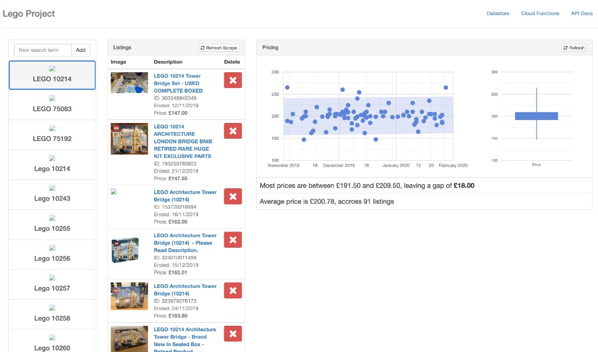
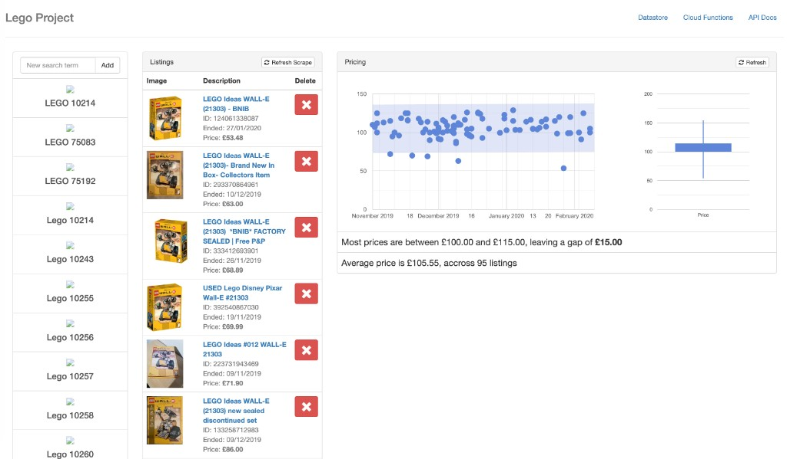
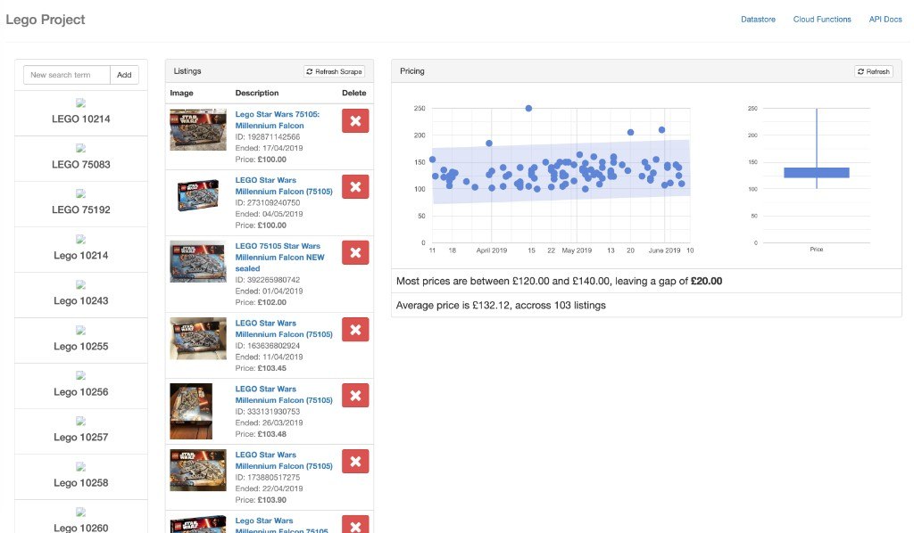

# Lego Price Tracking

A side project that scraped completed eBay UK sales for Lego sets, stored them in Google Cloud Datastore, and plotted price history in a one-page dashboard.

Write-up: [Playing the Lego stock market on eBay](https://manoj.ninja/articles/2020/02/04/playing-the-lego-stock-market-on-ebay)

I built it to spot mispriced sets before everyone else. I stopped when the numbers made it obvious: sold Lego on eBay already behaves like a real-time stock market. The scrapers are left as-is and will not work against today's eBay HTML. Python 3.7 is retired too.

## What it looked like

The dashboard had three columns: a watchlist of set numbers, scraped sold listings you could hide, and a price chart with a simple IQR summary.

**10214 Tower Bridge** — most sales sat between £191.50 and £209.50. Average £200.78 across 91 listings (Nov 2019 – Feb 2020).



**21303 WALL-E** — a tighter band, £100–£115. Average £105.55 across 95 listings.



**75105 Millennium Falcon** — earlier scrape, Apr–Jun 2019. Most prices £120–£140. Average £132.12 across 103 listings.



## What it did

1. You typed a search term such as `LEGO 75192`.
2. `history` scraped sold, new-condition eBay listings over £50 and wrote them into Datastore under a `SearchTerm` parent.
3. `api-update-search-term-stats` computed min / 25th / 75th / max / average prices with numpy.
4. The dashboard (`frontend/lego.html`) listed results, hid junk listings, and drew a scatter chart plus a candlestick of the price spread.

The earlier `discovery` function scraped live auctions instead of completed sales. `testing` was the first spike: fetch one eBay results page and return the HTML.

## Layout

```
frontend/lego.html          dashboard (Bootstrap 3 + Google Charts)
screenshots/                dashboard as it ran in 2019–2020
functions/
  testing/                  raw eBay HTML fetch
  discovery/                live-auction scraper (superseded)
  history/                  completed-sales scraper (what the UI called)
  get-search-terms/         early search-term list
  api-get-search-terms/     search terms plus stored stats
  api-get-listings/         listings for one search term
  api-hide-listing/         soft-hide a listing
  api-update-search-term-stats/
```

## Runtime (as deployed)

- Cloud Functions, Python 3.7, `hello_http` entry point
- Regions: `europe-west1` for most functions, `us-central1` for stats + testing
- Datastore kinds: `SearchTerm`, `Listing` (listings are children of a search term)
- No API keys. eBay was scraped as a public HTML page. Datastore used the function's default service account.

## Timeline

| Date | What landed |
| --- | --- |
| 5 Jun 2019 | `testing`, then `discovery` |
| 7–10 Jun 2019 | Datastore APIs, stats, first dashboard |
| 30 Jan 2020 | `api-get-search-terms`, `history` |
| 4 Feb 2020 | Refresh-scrape button wired to `history` |
